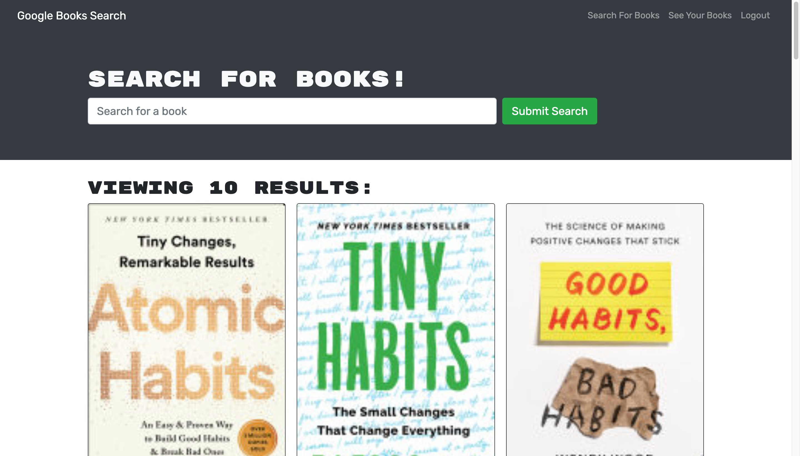

  
  
  # Title:
  Library
  

  ## Table of Contents: 
  * [Project Description](#description)
  * [Installation](#installation)
  * [Usage](#usage)
  * [License](#license)
  * [Test](#test)
  * [Questions](#questions)
  
  ## Description:
  The Book search engine is an application is leveraging the entire MERN stack and with a React front end, MongoDB database, and Node.js/Express.js server and API. It's set up to allow users to save book searches to the back end. The application is built using Google Books API search engine build with GraphQL API and Apollo Server.
  ## Installation:
  1.Fork the repository from GitHub to your profile.

  2.Clone the repository down to your local machine in command-line using: git clone.

  3.Node.js is required to run this application. Click here for instructions on installing Node.js.

  4.Install the required dependices to your cloned directory in command-line using: npm install
  ## Mock up
  

  ## Test
  N/A
   ## Questions
  Contact me for any questions!!
  * Contact Email: kahurasamuel@gmail.com
  * GitHub Profile: [snk-99](https://github.com/snk-99snk-99)

[Deployed Link]()
